# claycore

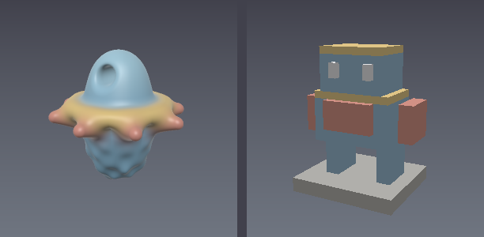

<sub>Left: a smooth-blended distance field — spheres and a torus joined by
smooth-min, a radial array of spokes, a displaced base, a bored-through head.
Right: a palette-indexed voxel figure sculpted with box fills, mirrored
placement and an eraser brush. One library, both representations; produced by
[`examples/00_hero.py`](examples/00_hero.py).</sub>

Portable, headless C++20 sculpting engine carrying **three representations side
by side** — a re-editable SDF edit list, a sparse voxel grid, and a mesh layer
whose own vertices are editable in place — with one stroke engine, one mask
model and one document spanning all three, and conversions in every direction
between them.

Single-source distance-field kernels compiled into CPU, Metal, CUDA, OpenCL and
Vulkan backends; ordered-edit-list scene semantics with per-node exactness and
Lipschitz tracking; sparse brick evaluation with a memory budget; watertight and
quad-only meshing; document and mesh I/O; Python (`pyclay`) and C-ABI/Swift
bindings.

claycore is the engine core of **ClaySpace** (iPad sculpting app) and stands
alone for tools, pipelines, CI, and research.

- Spec: `openspec/specs/` — the living requirements (14 capabilities,
  from `sdf-kernels` to `build-packaging`).
- Math reference: `docs/01-sdf-math-foundations.md`.
- Architecture: `docs/05-claycore-library.md`.
- Host GPU previews: `docs/06-host-gpu-previews.md` — compile claycore's
  kernels into your own shaders instead of copying them, and gate the result
  with the parity fixture.
- Brushes and features: `docs/07-brushes-and-features.md` — every sculpting
  verb, what it does, how it is parameterised, its ZBrush equivalent, and
  §11: the same verb across SDF, voxel and mesh, and which one to reach for.
- Reading a mesh back: `docs/08-mesh-readback.md` — getting faces, vertices,
  normals, colours and UVs out of the library, in Python, C and C++.
- Brush latency and coverage: `docs/09-brush-latency-and-coverage.md` — every
  brush against ZBrush and Nomad, what it costs on the reference iPad, what has
  to get faster, and which have a test and a committed render.
- Where we stand: `docs/sculpt_comparison.md` — claycore against Blender,
  ZBrush and 3DCoat, what it wins outright, and what is missing before an app
  built on it could compete.
- Releasing: `docs/RELEASE.md`.
- Examples: `examples/` — runnable scripts with committed renders.
- Roadmap: `openspec/ROADMAP.md` — what is missing and in what order.

## Architecture

Three representations under one document, one stroke engine reaching all of
them, and every backend compiled from the same distance functions rather than
from a copy of them.

The direction of the arrows is not decoration: it is the module dependency rule
`tools/check_layering.py` enforces on every build. A module may only reach
downward, and **no module may include a backend header** — which is what keeps
the core buildable, and testable, without a GPU at all.

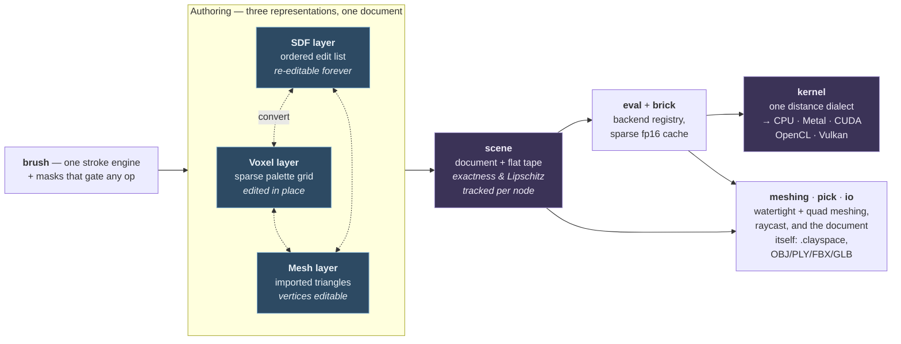

**The two things this shape buys.** A host GPU preview can compile
`clay/kernel/` into its own shader instead of reimplementing the maths — the
headers pick their dialect from the compiler, so a `.metal` file needs one
include and no build flags. And because the representations sit side by side
under one document, a sculpt crosses between them without leaving the library:
block out as a field, rasterize to voxels, sculpt, come back as an operand.

## Gallery

Every image on this page — the one above included — is produced by a script in
[`examples/`](examples/README.md) and regenerated by `python examples/run_all.py`.
No renderer dependency: the examples trace the field through `raycast_many` and
write PNGs with the standard library.

| | |
|---|---|
| 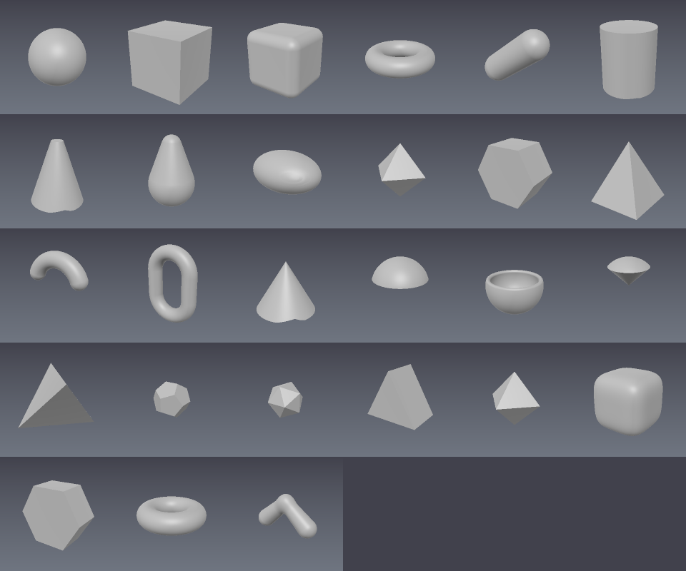 | 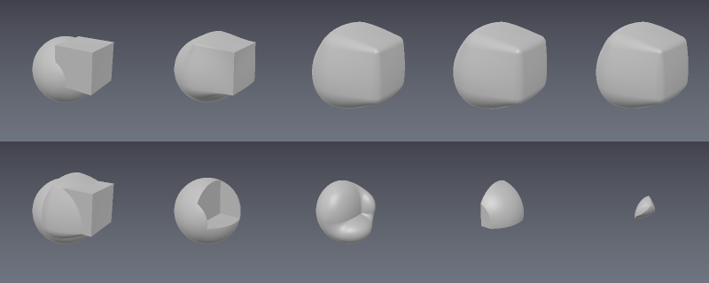 |
| Every primitive in the kernel set | The same two shapes under every combine mode |
| 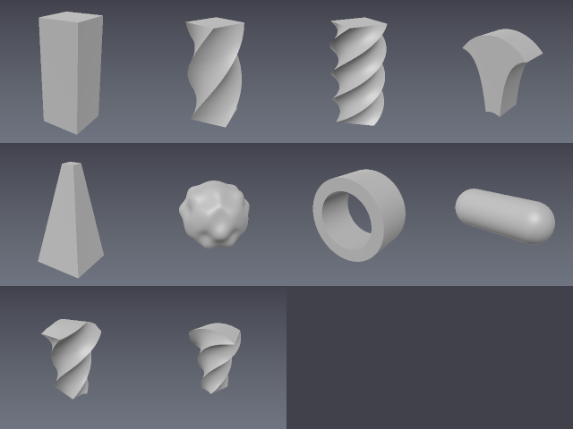 | 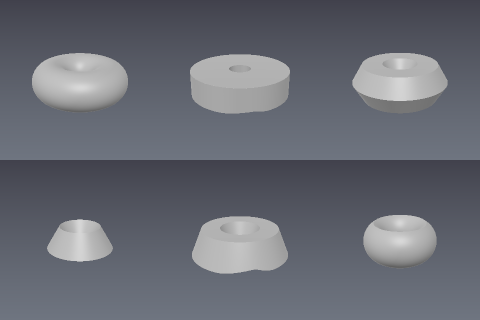 |
| Twist, bend, taper, displace — and chain order | 2D profiles revolved into 3D |
| 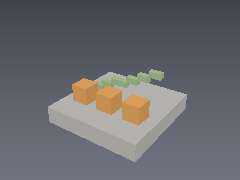 | 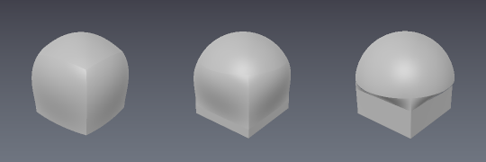 |
| Voxel brushes, fills and palettes | Morphing a box into a sphere |
| 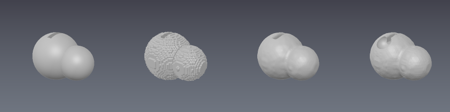 | 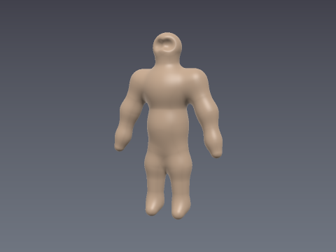 |
| SDF → voxel → SDF: blocked out as fields, sculpted as voxels, back as an operand | An armature — a ZSphere tree skinned by its blend |
| 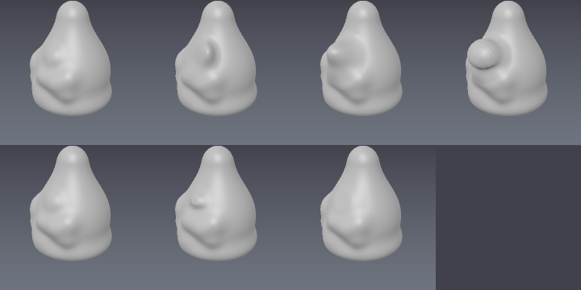 | 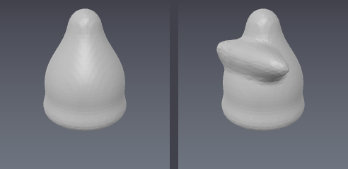 |
| Sculpting a carried mesh's own vertices — and never its polygons | A quad export before and after a stroke; the quad list is unchanged |
| 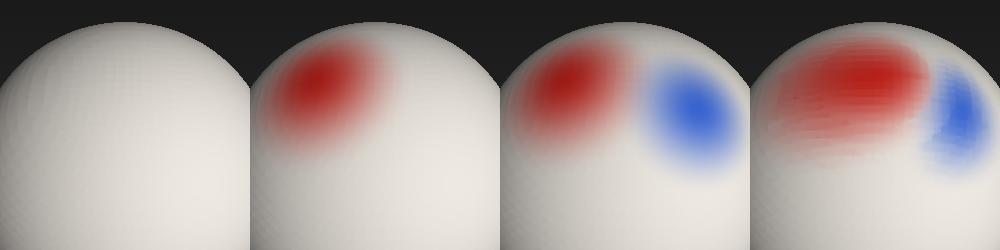 | 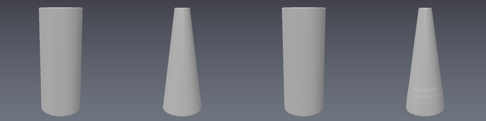 |
| Paint and smear on a mesh layer — the only verbs that move no vertex | Taper and twist on a mesh, and a mask holding half the form still |
| 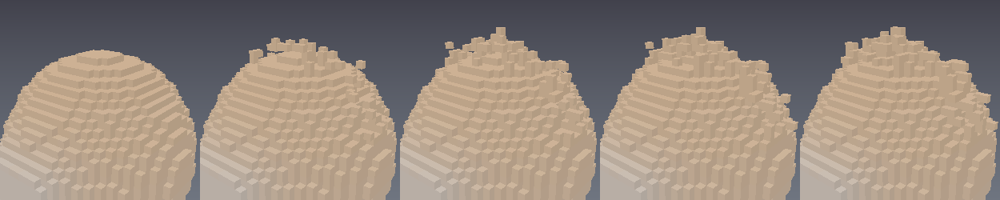 | 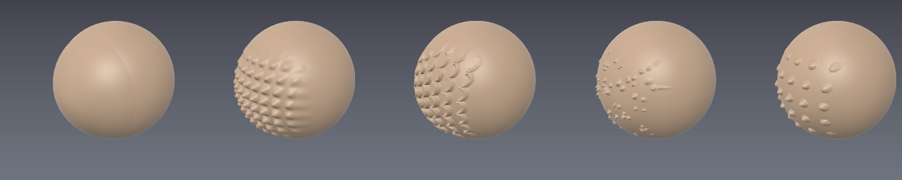 |
| A sculpt layer dialled from 0 to 1 — a pass you can regret an hour later | Alphas on the non-destructive representation, not just the baked one |
| 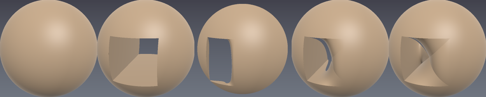 | 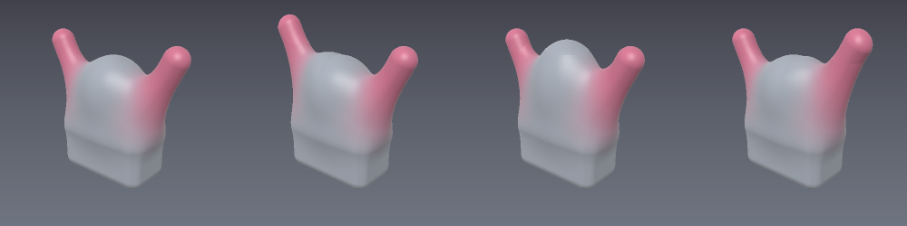 |
| A painted mask gating a boolean — masking protects from *any* op | The lattice gizmo: drag control points, the whole form follows |

## Three ways to sculpt: SDF, voxel and mesh

claycore carries three representations side by side, and a document can hold
layers of all three. They are not three APIs for one thing — each is good at
what the others are structurally bad at, and the intended workflow uses more
than one.

A **mesh layer** used to be listed here as a carrier rather than a way to
sculpt, and that was true when its triangles were read-only. It no longer is:
sixteen fixed-topology brushes, taper and twist, a lattice cage, masks, the
stroke engine and a bit-exact undo record all reach a mesh layer's own
vertices.

**But three ways to sculpt is still two ways to compose**, and that distinction
is worth keeping rather than flattening — see below for what it actually means.

An **SDF layer** is an ordered list of parametric edits — primitives, booleans,
blends, deformers, strokes — compiled into a flat tape and evaluated as a
continuous distance field. A **voxel layer** is a sparse palette-indexed grid of
occupied cells, edited in place. A **mesh layer** is imported triangles held
verbatim, whose vertices move and whose polygons never do.

| | SDF layers | Voxel layers | Mesh layers |
|---|---|---|---|
| **What an edit is** | A node in an edit list — re-editable forever: retransform, re-blend, reorder, remove | An in-place cell write — immediate, but not replayable | A vertex move. **Topology never changes** — `indices` and `quads` come out byte for byte |
| **History** | The document *is* the history; undo/redo, coalescing and serialization come for free | No history; a host snapshots if it wants undo | A sparse per-gesture record that reverts bit-exactly — undo, but not an edit list |
| **Resolution** | An evaluation parameter — the field is continuous, so there is no "too coarse" | Real storage, chosen up front — with a stack of levels to refine only where the detail goes | Fixed by the import. Nothing re-tessellates, so detail is bounded by the triangles you already have |
| **Precision** | Exactness and Lipschitz bounds tracked per node; booleans are watertight by construction, raymarching provably correct | Occupancy, not distance — a bound, not a metric | Exact vertices, and no field at all — so nothing to track and nothing to steepen |
| **Free-form sculpting** | Smooth/flatten **bake** into volumes, and chained bakes steepen the field until consolidation redistances it | Smooth, inflate, pinch, smudge chain forever at no cost — each verb is a local cell operation | Sixteen verbs chain at no field cost, but a large pull **stretches** the triangles it has, which is the signal the mesh wants retopo |
| **Colour** | Per item, plus `Paint` regions | Per cell, via the palette | Per vertex, via `paint` and `smear` |
| **Composability** | Already an operand: boolean it, blend it, deform it, reorder it | Becomes one via `Volume.from_voxels` — non-destructive, and loses nothing the grid had not already quantised | Becomes one via `Volume.from_mesh`, which quantises exact vertices and loses the edge loops. `Mesh.transfer_attributes` refunds the colours and most of the uvs afterwards; **the topology is what it does not give back** |
| **Scaling cost** | Deep edit lists degrade the safe step scale (grab/relief/noise items each cost some) | Flat per-cell cost however many edits landed | O(the vertices a falloff reached), after an O(vertices) adjacency build the session pays once |

The short version: **block out and hard-surface on SDF, free-form sculpt on
voxels, and refine on a mesh when the topology is one you want to keep.** The
SDF side is where a model stays parametric — change a blend radius from an hour
ago, mirror a layer, cut with an exact prism. The voxel side is where you push
material around like clay without the field steepening underneath you. The mesh
side is where a retopologized model gets detailed without spending the
retopology.

### Sculpting and composing are not the same operation

The two words get used interchangeably and they are different things here, so
it is worth being precise about which one a representation can do.

**Sculpting changes one shape.** You take a surface and a gesture — a dab, a
drag, a smooth pass — and the surface comes out different. Afterwards the
gesture is spent: what you have is the new shape (plus, on the SDF side, a
record of how you got there).

**Composing defines a new shape in terms of others.** `A ∪ B`, `A − B`, a smooth
union with a blend radius. The parts do not disappear into the result — they
stay separately editable, and so does the *relationship*. That is what lets you
change a blend radius from an hour ago, swap the sphere for a box, or reorder
two booleans and have the model reassemble itself.

#### Why composing needs a distance field

To evaluate `A ∪ B` at a point you need `d_A(p)` and `d_B(p)` — a **signed
distance from any point in space** to each operand, not just a surface you can
look at. That is what a boolean takes the min or max of, what a smooth union
blends between, and what the raymarcher steps along to find the surface at all.

So an operand has to answer one question everywhere: *"how far are you, and
which side am I on?"*

- An **SDF item** answers by construction. That is what it is.
- A **voxel grid** does not: occupancy is a yes/no per cell with no distance in
  it. But a grid is *already a lattice*, so reading it trilinearly and
  **redistancing** produces a field that does answer — and loses nothing the
  grid had not already discarded when it was rasterized.
- A **mesh** does not either. Triangles carry no inside/outside and no
  distance without a query structure, and answering per sample would mean a
  closest-point search plus a winding-number test **inside the raymarcher's
  inner loop**.

#### One composition model, three prices of admission

Everything composes in exactly one place: the SDF edit list. `compile_document`
chains *visible SDF layers* — a voxel layer and a mesh layer are not in the tape
at all. So "compose" means "become an SDF item", and the three representations
differ only in what that costs:

| | Price of admission |
|---|---|
| **SDF item** | Free — it already is one |
| **Voxel grid** | `Volume.from_voxels`. Non-destructive: the grid is untouched, and the result loses nothing the grid had not already quantised |
| **Mesh** | `Volume.from_mesh`. Quantises exact vertices onto a lattice and drops the UVs and edge loops — **precisely what made it worth keeping as a mesh** |

That is why the shorthand is *two*: two representations round-trip into
composition as an ordinary workflow, and the third can but in practice does not,
because paying the price costs the retopology the mesh was imported for. You can
sculpt a mesh all day; subtracting a cylinder from it spends the thing you were
protecting.

### What each representation has

**SDF layers** (per-verb detail in
[`docs/07-brushes-and-features.md`](docs/07-brushes-and-features.md)):

- 16 combine ops — add/subtract/intersect/paint plus the extended set (groove,
  tongue, pipe, engrave, emboss, inset, shell, replace, relief/incise) — under
  5 blend profiles
- 21 deformers: twist and bend (whole-item, **ranged** across a span and
  held beyond it, which is what a gizmo's box does, or **bent along a drawn
  guide** when a circular arc is not the shape you meant), taper, displace,
  noise, elongate, wrap-around, a **lattice** cage, and the brush-like grab,
  pose, pose-line and magnify (pinch is magnify with a negative sign, and
  **blob** is noise under the same finite support — ZBrush's, so one dab both
  swells and eats in)
- **Alphas**: a caller-supplied scalar stamp modulating a surface under finite
  support, so detail work is alpha-driven on the non-destructive
  representation rather than only on the baked one. The engine decodes no
  images — a host passes the samples
- Resolvers: the cut tool (rect/circle/polygon/lasso/trim-curve), snakehook,
  the Move brush (drags the *assembled* surface), and tubes
- Baked field operations: relax (Smooth), flatten (two-sided / hPolish cut-only
  / fill-only), Move Topological, and mask extrude
- **Live sculpt transactions** for the two brushes an edit list cannot spell:
  Smooth samples the layer once at pointer-down, relaxes its own working volume
  per dab and installs that volume at pointer-up; Move finds the items a drag
  reaches once and previews one warp per frame from the untouched pre-stroke
  chains. Between pointer-down and pointer-up the document does not change —
  no nodes, no deformers, no undo entries — and one gesture is one undo step.
  An explicit session policy decides, between strokes and never during one,
  when a long session's deformer history may be collapsed
- The stroke engine: spacing, pressure, jitter, taper, steady stroke, buildup
  vs clamped — a stroke resolves into ordinary edit items
- **Masking that gates any operation**, a boolean included: an item carries the
  measured distance to a painted mask's region and does not act where it
  protects, so the gate rides the combine record rather than being a mode
- **Symmetry as a layer mode**: a mirror on any of x/y/z with a blended
  seam, and a radial array of any count about a layer-local axis. Both are
  applied at evaluation, so one node exists and the copies cannot drift;
  both use one per-item opt-out; and because strokes are items, a stroke on
  a symmetric layer repeats without the caller touching what it resolved
  into. `Repeat::radial` remains the per-item modifier for large arrays
- Armatures (see the next section) and layer mirrors

| | |
|---|---|
| 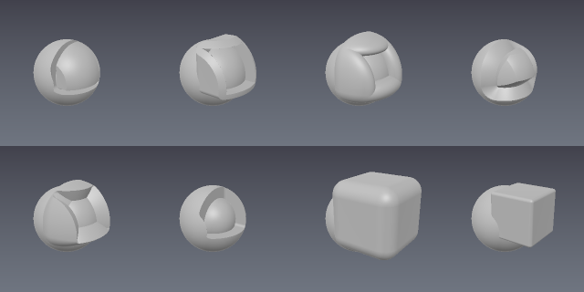 | 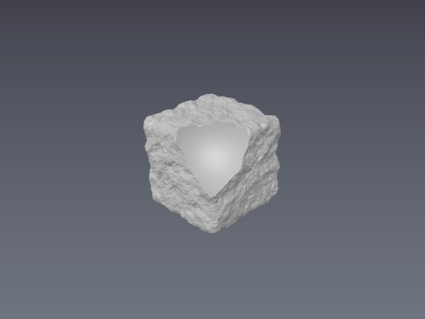 |
| The extended combine ops: groove, tongue, pipe, engrave, emboss, inset, shell, replace ([`02_blends.py`](examples/02_blends.py)) | The noise deformer weathering a box — and composing with a boolean bite ([`24_noise.py`](examples/24_noise.py)) |
| 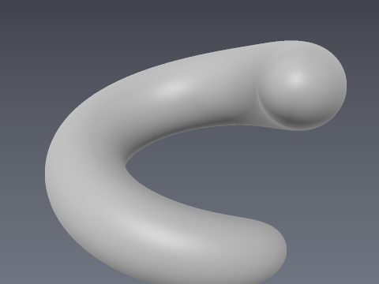 | 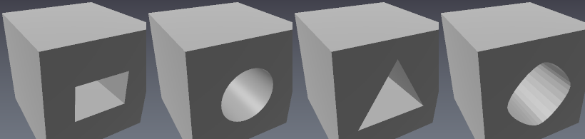 |
| A stroke: one gesture, one undo step, ordinary edit-list nodes ([`12_strokes.py`](examples/12_strokes.py)) | The cut tool — rect, circle, polygon and lasso, each an exact prism ([`14_cut.py`](examples/14_cut.py)) |
| 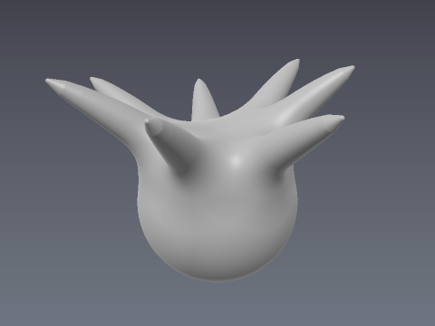 | 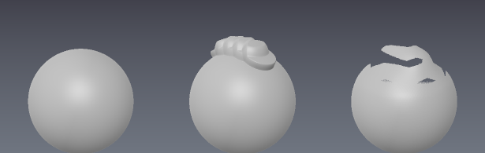 |
| Snakehook tendrils grown from a sphere ([`22_snakehook.py`](examples/22_snakehook.py)) | The blockout pair: a ClayBuildup stroke, then Smooth ([`29_claybuildup_smooth.py`](examples/29_claybuildup_smooth.py)) |
| 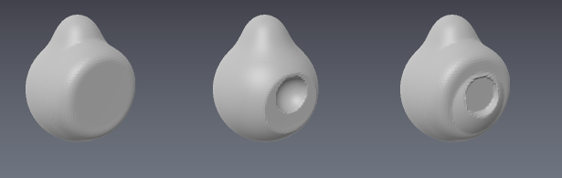 | 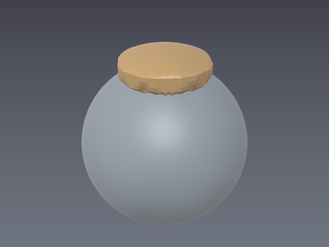 |
| Flatten's modes: two-sided, cut-only (hPolish), fill-only ([`21_flatten.py`](examples/21_flatten.py)) | Mask extrude: a painted patch pulled off as a solid ([`33_mask_extrude.py`](examples/33_mask_extrude.py)) |

**Voxel layers**:

- 10 sculpting verbs: smooth, inflate/erode, flatten, pinch, magnify, grab,
  fill-cavities, scrape, smudge, and carve-with-alpha
- Cube/sphere paint and erase brushes with falloff curves and strength, box
  and line fills, flood select, mirrored edits
- Pre-bake repair: report, close holes, fill voids
- A stack of resolution levels — block out coarse, `add_level` to refine where
  the detail goes, without paying for a fine grid everywhere
- **Sculpt layers** — ZBrush's headline feature, on a grid: bracket a run of
  strokes and the grid records what they *changed*, so their strength stays
  adjustable long after they are finished. Not undo, which is a stack you pop;
  a layer is addressable

| | |
|---|---|
| 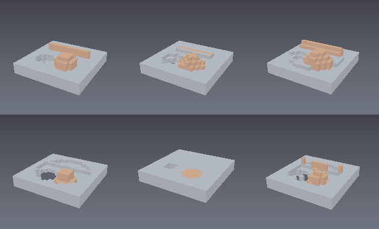 | 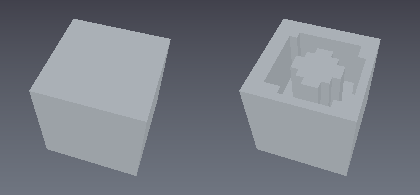 |
| The sculpting verbs over a bumpy slab ([`09_sculpt_brushes.py`](examples/09_sculpt_brushes.py)) | Carve-with-alpha: a stamp pattern cut into the top face ([`15_voxel_verbs_and_repair.py`](examples/15_voxel_verbs_and_repair.py)) |
| 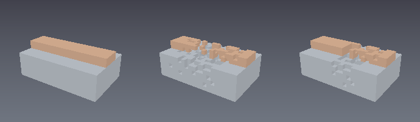 | 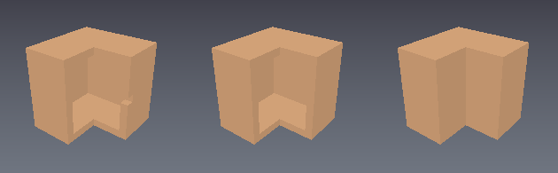 |
| A mask freezes cells: the same brush, unmasked and masked ([`11_masks.py`](examples/11_masks.py)) | Pre-bake repair: pierced shell, holes closed, voids filled ([`15_voxel_verbs_and_repair.py`](examples/15_voxel_verbs_and_repair.py)) |
| 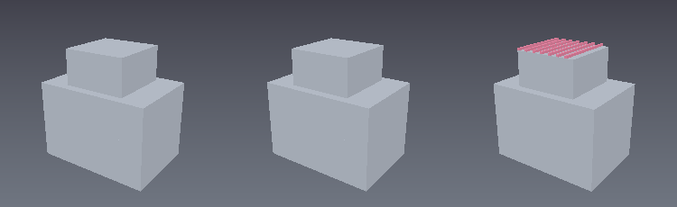 | 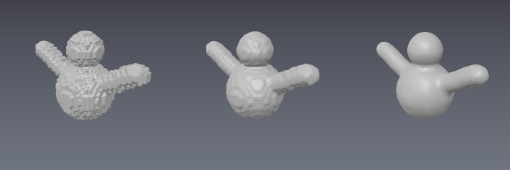 |
| The resolution level stack: the same sculpt at level 0, 1 and 2 ([`39_multi_resolution.py`](examples/39_multi_resolution.py)) | The same grid meshed blocky, smoothed, and for display ([`41_voxel_smooth_display.py`](examples/41_voxel_smooth_display.py)) |

The **stroke engine and masks span all three**: one resolved stroke writes SDF
nodes (`stamps_to_nodes`), voxels (`apply_to_grid`), a mask (`apply_to_mask`)
or a mesh layer's own vertices (`apply_to_mesh`) — four consumers, one set of
spacing, pressure, jitter and taper semantics. A painted mask freezes a region
against every verb on every representation, and against any *operation* on the
SDF side: the gate rides the combine record, so it protects from a boolean the
same way it protects from a brush.

### The same verb on three representations

Most of the sculpting vocabulary exists on more than one representation, and the
versions are not interchangeable — they differ in what they cost, what they
preserve, and whether the gesture stays editable afterwards. This is the table
for "where should I do *this*"; the complete one, with every verb and its API
names, is in
[`docs/07-brushes-and-features.md` §11](docs/07-brushes-and-features.md).

| Verb | SDF | Voxel | Mesh | Which to reach for |
|---|---|---|---|---|
| **Smooth** | `field::relax` — **bakes**; live through `session::SdfSmoothTransaction` | `sculpt_smooth` | `Smooth` | **Voxel** when passes must chain at no cost — each SDF bake steepens the field until `consolidate` redistances it. SDF Smooth is now *live* inside a transaction: one bake per gesture instead of one per dab |
| **Flatten** | `field::flatten` — two-sided / cut-only / fill-only | `sculpt_flatten` — two-sided | `Flatten` — the same three modes | **SDF or mesh** when you want hPolish, which is cut-only; voxel when you want to repeat it |
| **Inflate** | `Op::Relief` | `sculpt_inflate` (dilates, or erodes when negative) | `Inflate` — each vertex's own normal | **SDF** while it must stay re-editable, voxel for free repetition |
| **Pinch / Magnify** | `magnify`, one signed strength | `sculpt_pinch` / `sculpt_magnify` | `Pinch` — tangential, signed | Same shape everywhere. Pick by which layer already holds the form |
| **Grab** | `grab` deformer — one item's own field | `sculpt_grab` — the same inverse map | `Grab` — vertices, polygons stretch | **SDF** for a nudge you can revisit. On voxels a drag under half a cell **on every axis moves nothing** |
| **Move** (the assembled surface) | `brush::move_brush`, `field::move_topological` | — | `Grab` | **SDF only.** It is the one side that drags the *assembled* surface, and the only Move Topological |
| **Scrape** | — | `sculpt_scrape` | `Scrape` | Either. Both are flatten **and** smooth from *one* snapshot, which calling the two in sequence does not reproduce |
| **Smudge / Nudge** | — | `sculpt_smudge` — smears the skin | `Nudge` — slides the region | Voxel to drag a surface without its interior, mesh to slide material along the form |
| **Snakehook** | `brush::snakehook` — **adds** material | — | `Snakehook` — stretches what is there | **SDF** to grow a tendril. On a mesh it is the quickest way to discover the model wants retopo |
| **Crease / DamStandard** | `Op::Incise` | deliberately absent — a recipe, not a verb | `Crease` — a negative draw *and* a pinch in one stamp | SDF for an exact cut line, mesh for a stamped one |
| **Clay / ClayBuildup** | `Op::Relief` along a stroke | — | `Clay` — deposit clamped to a floating plane | SDF while blocking out, mesh for a bounded deposit |
| **Polish** | `field::flatten` cut-only (hPolish) | — | `Polish` — smoothing gated by how much the surface bends | **Mesh** when the corners must survive the pass |
| **Colour** | per item, plus `Paint` regions | per cell, via the palette | `Paint` / `Smear` | All three |
| **Alphas** | `Deformer::alpha` — a *deformer*, not a primitive | `sculpt_carve_alpha` | — | Both non-mesh sides; SDF keeps it non-destructive |
| **Mask extrude** | `brush::mask_extrude` | `clay_voxel_mask_extrude` | — | SDF when the extracted patch should stay an operand |

**Only on one side, and structurally so:** booleans, blends, the cut/trim tools
and armatures are **SDF** — that is composition, not sculpting, and it needs a
field (see above). Cavity fill and pre-bake repair are **voxel** — they are
questions about occupancy. `Draw`, `Layer`, `Relax` and the lattice cage over a
mesh's own vertices are **mesh**, and `Relax` is worth singling out: it recovers
a stretched *grab* by evening vertex spacing, and it does **not** recover a
deformation — after a taper, six passes move edge-length variation from 0.2929
to 0.3050, slightly worse, because a taper leaves the same vertex count around a
smaller circumference and no verb that slides vertices can change how many a ring
has.

**What it costs** on the reference iPad, per verb and per tier, is in
[`docs/09-brush-latency-and-coverage.md`](docs/09-brush-latency-and-coverage.md)
— the voxel verbs are per-dab interactive, the baked SDF operations are
gesture- or operation-scale, and that difference is often the deciding one.

### Converting between them


The bridge runs both ways, so the intended round trip works: **block out on
SDF, rasterize to voxels, sculpt with the voxel verbs, come back as an
ordinary SDF operand** — and boolean against it, blend it, keep sculpting.
[`examples/42_representation_round_trip.py`](examples/42_representation_round_trip.py)
makes exactly that trip.

**SDF → voxel** — `VoxelGrid.rasterize(doc, region)` in Python,
`clay_voxel_rasterize` in C. Cells whose centre evaluates inside are set, and
colour comes from the tape's colour field via nearest palette entry. Lossy in
the ways lattice sampling is, stated rather than hidden: the surface moves by
up to half a cell, a feature thinner than a cell can vanish (rasterize finer —
nothing downstream can invent what was never stored), a sharp edge becomes a
staircase at the cell size, and only the region you pass is rasterized.

**Voxel → SDF** — `Volume.from_voxels(grid)` in Python,
`clay_item_volume_from_voxels` in C, or `clay_voxel_to_layer` to convert a
whole coloured sculpt into a new layer in one call (one volume item per palette
entry, so colour survives). Direct — no mesh detour: occupancy is read by
trilinear interpolation between cell centres and **redistanced**, so the result
carries a Lipschitz bound a raymarcher and a blend can trust. Non-destructive:
the grid is untouched, and the result is an ordinary volume item in an
ordinary SDF layer.

**Mesh → voxel** — `VoxelGrid.rasterize_mesh(mesh)` in Python,
`clay_voxel_rasterize_mesh` in C. An imported model reached an SDF layer in one
step and a grid only in four, paying **two** samplings: triangles into a narrow
band, then the band into cells. Each places the surface within about half a cell
of its own lattice, so the second quantised a field that was already quantised.
This asks the triangles directly — membership by the same generalized winding
number `Volume.from_mesh` uses, so a hole degrades the sign instead of flipping
a half-space. Two things fall out of doing it once: a feature thinner than a cell
survives where the detour lost it, and **the model's vertex colours reach the
palette**, which the detour cannot carry because a distance field has no colour
in it. The region is optional here — a document may be unbounded, a mesh cannot.

What conversion costs, in both directions: the surface is preserved to within
about a cell, and the colour survives. Exactness and the procedural history do
not — once rasterized, the parametric items behind the sculpt are no longer
reachable from the voxel side, which is why the return trip hands back a new
layer instead of touching the original.

### The mesh layer, in detail


A **mesh layer** carries imported triangles *verbatim* and is never evaluated —
no tape, no blend, no influence bound. That is what a scan, a kit part or a
piece of retopology needs, and it is enforced by the module layering rather
than by a promise. It is also the whole of the difference from the other two:
you can sculpt it, and you cannot compose with it.

It used to be read-only in every sense that mattered. The only way to *edit* one
was `Volume.from_mesh`, which resamples the model onto a lattice: the sculpt
comes back, the edge loops and the uvs do not — so a mesh that had just been
retopologized could not be touched without spending the retopology.

**Fixed-topology mesh brushes** are sixteen verbs applied to a mesh layer's own
vertices — the eleven classical ones (grab, draw, inflate, smooth, pinch,
flatten, clay, crease, scrape, polish, snakehook), then relax, layer and nudge,
and finally **paint and smear**, the only two that move no vertex at all. All
sixteen hold one line above everything else: **topology never changes.** No
polygon is created, split or deleted; `indices` and `quads` come out byte for
byte, which the tests compare rather than count.

**Colour is editable here too**, which makes the mesh layer the last
representation whose surface colour was read-only. `paint` blends toward a
target by the brush's own weight and `smear` drags existing colour along the
stroke; both refuse a mesh with no colour attribute rather than creating one,
because twelve bytes per vertex is a real cost to hide behind a brush stroke.

**Taper and twist** reach a mesh layer as well (`MeshSculptor::deform`), which
is a different kind of thing from a brush: no centre, no radius, no falloff,
because a deformer states something about the *form* and a brush about a dab.
They are applied as FORWARD point maps once per vertex — the opposite direction
to the SDF deformers of the same name, which must run backwards to answer
"where did the material at this point come from". Forwards is both the easier
direction and the exact one, so a tapered mesh and a tapered field are the same
shape. There is deliberately no `bend`: its map folds distinct points onto the
same place past a gentle angle, so no forward map exists.

A **lattice cage** works on the same layer: drag a few control points and the
whole form follows. Both representations have one, and they are not the same
deformer — ZBrush and Blender apply FFD *forward* to vertices, which is exactly
what a mesh allows, so `mesh::Lattice` does that and is exact. An SDF deformer
must run backwards, and forward FFD has no closed-form inverse, so the SDF cage
authors its offsets AS the inverse warp instead; the difference from the forward
cage measures under 1.5% of the drag. The mesh cage also affords 32 divisions
per axis against the SDF cage's 4, because one runs per vertex and the other
runs inside the raymarcher. See
[`docs/07-brushes-and-features.md` §11](docs/07-brushes-and-features.md).

That is the whole point rather than a limitation. It closes the **return trip**:
sculpt on SDF or voxels → quad-export → retopo and UV elsewhere → bring the mesh
back and *refine it in place*. Masks, strokes (pressure, spacing, taper, buildup)
and a sparse bit-exact undo record all reach it; a mesh layer is also pickable
now, since a raycast against a field could never see one.

Stated rather than discovered: a large grab **stretches** triangles and
`snakehook` stretches them to the extreme. That is the artist's signal the mesh
wants retopo, exactly as Blender behaves with Dyntopo off — it is where this
stops, and `docs/sculpt_comparison.md` records the boundary as a decision.

`relax` is the verb that recovers a stretched *grab*, by sliding vertices along
the surface to even their spacing. It does **not** recover a deformation, and
that is measured rather than assumed: after a taper, six relax passes move
edge-length variation from 0.2929 to 0.3050 — slightly worse. A taper leaves a
cross-section with the same vertex count around a smaller circumference, so the
damage is *anisotropy*, and a verb that slides vertices cannot change how many
a ring has.

| | |
|---|---|
| 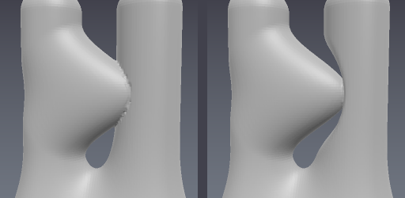 | 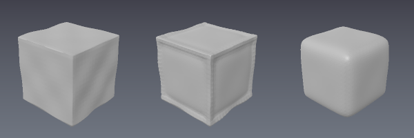 |
| Reach measured along the surface (left) versus in a straight line: one dents both prongs ([`47_mesh_brush_reach_and_undo.py`](examples/47_mesh_brush_reach_and_undo.py)) | The same heavy pass through polish and through smooth — the dihedral gate is what still holds the corners up ([`46_mesh_brush_compositions.py`](examples/46_mesh_brush_compositions.py)) |

## Armatures: blocking figures out with ZSpheres


claycore supports ZBrush-style **ZSpheres** as a first-class primitive:
`Prim::armature` is a **tree** of spheres — each node names a parent, each link
is the sphere-swept cone between the two — and the whole tree is one edit item.
`blend_k` is the skin: at 0 the links are a hard union and you see the
armature; above it the smooth union fills the crotches between links, which is
what turns a stick figure into a body. There is no separate skinning pass.

What it buys is *structure*: the same figure that takes forty-odd hand-placed
primitives is 18 armature nodes and a tree, and **moving the shoulder is one
edit the whole arm follows** — `move` carries every descendant.
[`examples/40_armature.py`](examples/40_armature.py) measures exactly that.

The editing vocabulary: `add_child` (plain, or **mirrored** — add a node and
its reflection through x = 0 in one edit, so you build one arm and get two),
`move`, `set_radius`, `set_sign`, `delete_subtree`. Every edit is undoable as a
whole-tree replace, so one undo puts a whole arm back. **Negative nodes** are
ZBrush's negative ZSphere: flip a node's sign and its subtree *carves* instead
of building — eye sockets, mouth cavities and the hollow of an ear are blocked
out this way, and skin never bridges a hollow's opening because links only
form between nodes of the same sign.

A placed armature also **reads back** — nodes, radii, parent topology and
signs — so a host that reloaded a document can re-pose a rig it did not
author. Details, including the two load-bearing evaluation rules, are in
[`docs/07-brushes-and-features.md` §6](docs/07-brushes-and-features.md).

## What ships today

Fourteen capabilities, specified in `openspec/specs/` and gated in CI. The
short version:

| | |
|---|---|
| **Author** | 28 primitives and 7 lifted 2D profiles, 17 combine ops under 5 blend profiles, 21 deformers, armatures (ZSpheres), control-point curves, the cut tool, grid/radial repetition and mirrors — all as an ordered, re-editable edit list with per-node exactness and Lipschitz tracking |
| **Sculpt** | One stroke engine feeding four consumers: SDF edit items, voxel cells, mask fields and a mesh layer's own vertices. 10 voxel verbs with sculpt layers, 16 fixed-topology mesh verbs including colour, taper and twist on meshes, baked field relax/flatten/move-topological, and masking that gates *any* operation |
| **Evaluate** | CPU, Metal, CUDA, OpenCL and Vulkan from one kernel source, tolerance-gated against the CPU reference; a sparse fp16 brick cache with LOD mips, a memory budget and eviction, so a host can answer a platform memory warning without destroying it |
| **Get it out** | Watertight marching tetrahedra, surface nets, dual contouring and quad-only meshing; scene and brick picking; `.clayspace` documents; OBJ, PLY, FBX and glTF GLB **in both directions** |
| **Embed** | A stable C ABI with versioned descriptors, a SwiftPM xcframework, `pyclay` (nanobind, numpy-native) and a `clay` CLI — with C-ABI/pyclay parity gated in CI |

**Per-verb detail — what each brush does, how it is parameterised and its
ZBrush equivalent — is in
[`docs/07-brushes-and-features.md`](docs/07-brushes-and-features.md).** How this
compares to Blender, ZBrush and 3DCoat, and what is still missing before an app
built on it could compete, is in
[`docs/sculpt_comparison.md`](docs/sculpt_comparison.md). What it costs on the
reference iPad is in
[`docs/09-brush-latency-and-coverage.md`](docs/09-brush-latency-and-coverage.md).

### What it deliberately does not do

Recorded as decisions rather than gaps, with the reasoning in
[`openspec/ROADMAP.md`](openspec/ROADMAP.md):

- **No dynamic topology** — no dyntopo, multires, subdivision or remeshing. An
  SDF sidesteps topology entirely; competing on dynamic tessellation is not
  this engine's fight. A large pull stretches the triangles it has.
- **No PBR channels.** Polypaint works on all three representations; roughness
  and metallic want a UV parameterisation and a texture set, which live
  upstream of this library.
- **No renderer, no UI, no scripting runtime.** It is a headless engine.

## Build

Requires CMake ≥ 3.24 and a C++20 compiler.

```sh
cmake --preset cpu-only     # any platform; +metal / +cuda / +opencl presets exist
cmake --build --preset cpu-only
ctest --preset cpu-only
```

Two sanitizer presets, both run per pull request. `asan-ubsan` is a Debug build
with Address and UB sanitizers; `tsan` is a RelWithDebInfo build with
ThreadSanitizer, which is what holds the C ABI's threading promise — that any
number of threads may evaluate one const document at once — since a lock the
code stopped taking still returns the right values and only a race detector can
say so.

```sh
cmake --preset tsan && cmake --build --preset tsan
setarch -R ctest --preset tsan   # ASLR OFF, and not optional
```

`setarch -R` disables ASLR for the run. TSan maps fixed shadow regions, and a
kernel handing out mappings with more entropy than it expects — Ubuntu 24.04's
`vm.mmap_rnd_bits=32`, for one — aborts with `FATAL: ThreadSanitizer:
unexpected memory mapping` before any test runs. `sudo sysctl -w
vm.mmap_rnd_bits=28` is the other fix.

## Backends

| Backend | Preset | Status | Capabilities |
|---|---|---|---|
| CPU | `cpu-only` | reference — always compiled in | everything; defines correctness |
| Metal | `metal` | tier 1 (the iPad app) | eval points/grid, raycast, hybrid meshing |
| CUDA | `cuda` | tier 2 | eval points/grid, raycast |
| OpenCL | `opencl` | tier 3, best-effort | eval points/grid; raycast and device meshing report `Unsupported` and fall back |
| Vulkan | `vulkan` | tier 3 | eval points/grid; shaders are GLSL generated from the same kernel headers, so a fifth backend is not a fifth copy of the maths |

Backend availability changes speed, never results: every registered backend
is checked against the CPU scalar reference by the parity suite (1e-4
relative on distances, 1e-6 for the CPU batch path).

The `cuda` preset targets the installed GPU. When that GPU is newer than the
CUDA toolkit — an RTX 50-series card against CUDA 12.0, say — nvcc cannot emit
a cubin for it, so the build falls back to the newest architecture the toolkit
does know, as PTX only, and the driver JITs it at load. Pass
`-DCMAKE_CUDA_ARCHITECTURES=...` to choose explicitly.

## Repository checks

```sh
python3 tools/check_layering.py        # module dependency rule
python3 tools/check_kernel_dialect.py  # kernel headers stay backend-portable
python3 tools/package_kernels.py       # publish dist/claycore-kernels/
python3 tools/package_kernels.py --verify   # ...and it still matches the repo
python3 tools/check_licenses.py        # permissive-license manifest gate
python3 examples/run_all.py            # every example runs (needs pyclay built)
python3 tools/check_binding_parity.py  # the C ABI reaches what pyclay reaches
python3 tools/check_swift_package.py   # the SwiftPM library product stays statically linked
./tools/check_swift_smoke.sh all       # Swift on macOS and in the iOS Simulator
swift run claycore-smoke               # the same, through the SwiftPM manifest
```

## License

MIT (see `LICENSE`). All dependencies are permissively licensed —
see `THIRD_PARTY_LICENSES.md`.
