# claycore examples

Runnable scripts that exercise the library through its Python bindings, with
their rendered output committed so the gallery is viewable without building
anything.

Every image on this page was produced by the script next to it. There is no
renderer dependency: `examples/_render.py` traces the field with
`Document.raycast_many` and writes PNGs with `zlib` and `struct` from the
standard library. Examples import only `pyclay`, `numpy`, and stdlib.

## Running them

```bash
cmake --preset cpu-only -DCLAY_BUILD_PYTHON=ON
cmake --build --preset cpu-only
PYTHONPATH=build/cpu-only/bindings/python python examples/run_all.py
```

Or, against an installed wheel:

```bash
python -m pip install .
python examples/run_all.py
```

`run_all.py` regenerates everything under `examples/output/` in place, so a
kernel change shows up as an image diff. Each script also runs standalone.
CI runs all of them and fails on a non-zero exit, so a binding rename breaks
the build rather than silently rotting the gallery.

Examples run one per core; `--jobs 1` puts them back in one process, which is
what to reach for when debugging a single failure. **Regenerate the committed
gallery with a plain run** — no environment set — because CI runs it with
`CLAY_EXAMPLES_FAST=1`, which halves each render axis and caps occlusion rays.
That flag exists because the gallery job cost about seventy minutes against
sixteen for everything else in the workflow, and one example accounted for most
of it: `34_organic_character` renders 560x680 with twelve occlusion rays per
pixel where the rest of the gallery renders around 205x195, and occlusion
multiplies raycasts per pixel. Fast mode changes how the images look and
nothing about what runs, which is all CI was ever checking — it throws the
renders away afterwards, because float output differs across platforms. 41/41
in 97s rather than 543s.

## The gallery

### 00 — the hero image

The README's banner: an SDF sculpt and a voxel sculpt side by side, rendered
at matching size and joined with a divider. Deliberately the same kind of
subject on both sides — one form in the round — so the contrast is the
representation, not the subject.


The SDF half is a lesson in blend radii: every feature has to sit *outside*
the body it blends onto, or smooth-min swallows it and the result is a plain
egg. The voxel half is a character rather than a landscape, because at this
size a landscape's voxels would each be a handful of pixels.

### 01 — primitives

Every primitive class the module exposes, enumerated from the module itself:
if a primitive is added to the bindings without a tile here, the example
fails rather than quietly under-reporting coverage.


The plane and infinite cylinder have no finite bounds, so they are shown by
what they carve out of a sphere. They also cannot be auto-framed — the
example passes an explicit camera, and `orbit_camera` raises rather than
returning a blank image.

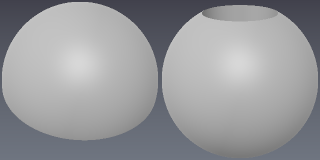

### 02 — blends and combine modes

The same sphere and box in every tile, so only the combination varies.


The eight extended modes shape the seam rather than the volumes.


Colour blends across a smooth seam, and `PAINT` recolours without touching
the field.

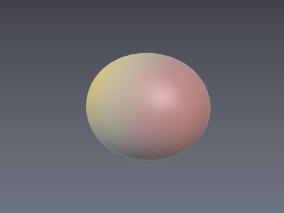

### 03 — deformers

Twist, bend, taper and displace, plus chaining. The last two tiles are the
same two deformers in opposite order — deformers apply in authoring order,
and the results differ. Each prints the safe step scale it costs, since a
warped field is no longer a true distance function.


### 04 — repetition

Finite grids, radial arrays, and infinite grids. The example prints the
bounds of each, because that is the part that matters: a finite array is
still cullable, while an infinite grid reports infinite influence and is
never dropped by per-brick culling.

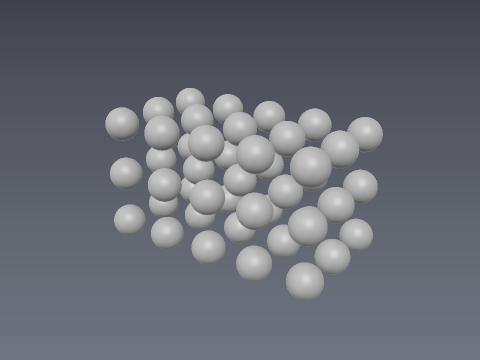
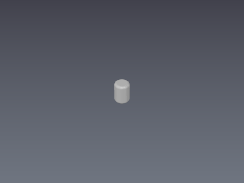

Repetition composes with deformers — this is an array of a twisted box.

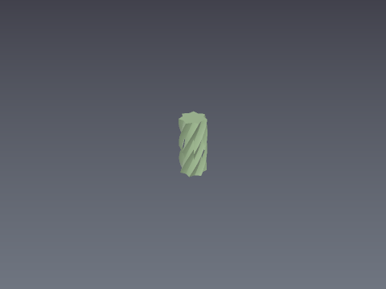

### 05 — profile lifts

Closed 2D profiles swept into 3D. Lifts are exact, so unlike deformers they
cost nothing in step scale.

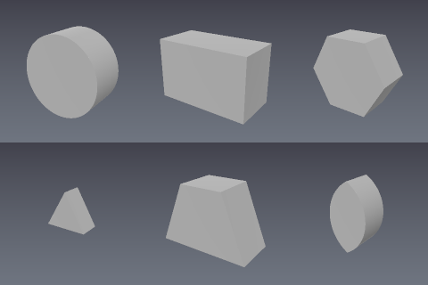


Polygon profiles handle concavity, including self-intersection, by the
even-odd rule.

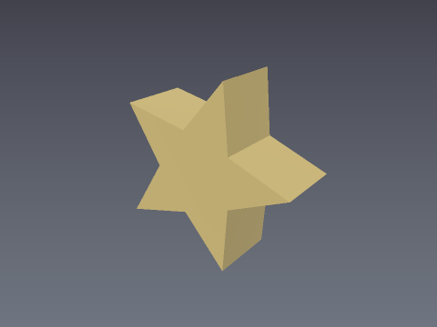
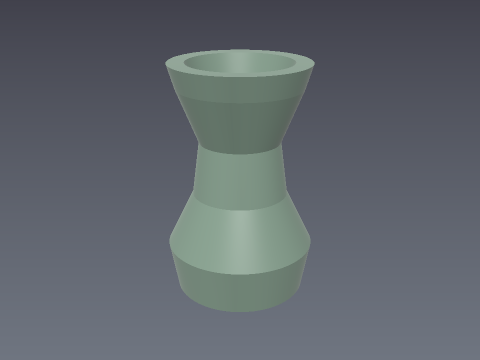

### 06 — transition morphs

Morphing a box into a sphere along an axis and outward from a centre, with
easing curves over the band.


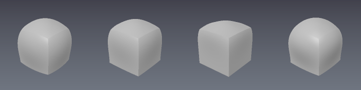
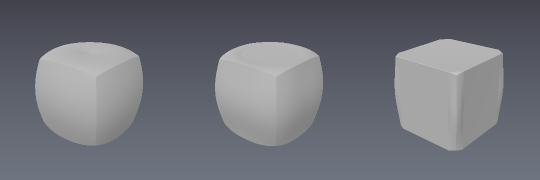

### 07 — voxel sculpting

Box and line fills, brush stamps, mirrored placement, flood select, erase and
paint, then greedy meshing and picking.


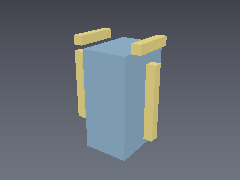
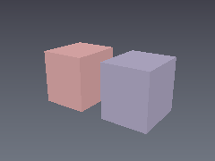
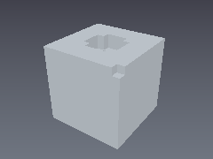

Brushes come in two footprints, cube and sphere, selected with `shape=`. A
brush of size N covers exactly N cells per axis for every N: the footprint runs
`-((N-1)/2) ..= N/2`, symmetric for odd N and biased half a cell toward the
positive axes for even N. The sphere is the ball of diameter N, so it is always
a subset of the cube and its occupancy ratio approaches π/6.

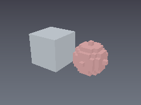

Voxel renders go through `VoxelGrid.raycast`, which handles one ray at a
time, so they run at lower resolution than the SDF examples.

### 08 — meshing and I/O

The three meshers compared, decimation ratios, watertightness, every export
format, the `.clayspace` round trip, and rasterizing an SDF into a voxel
layer.

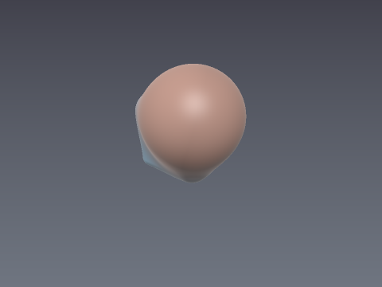
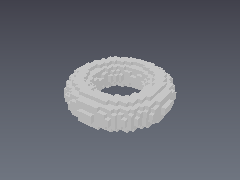

### 09 — falloff brushes and sculpting verbs

Occupancy is binary, so a soft brush cannot make a cell half-solid. What it
can do is cover a *fraction* of its footprint, thinning toward the rim. That
is a falloff curve resolved by dithering against a hash of the cell
coordinate — a hash rather than a random number, so the same stroke always
produces the same cells and these renders regenerate identically.

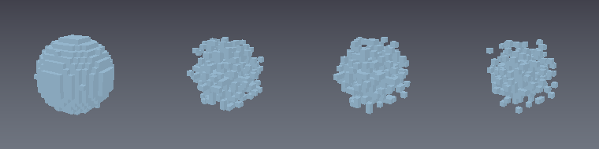

Strength scales the same curve down.

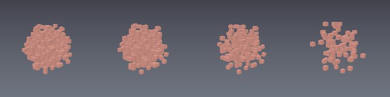

The four verbs reshape material rather than stamping a footprint. Every tile
starts from the same bumpy slab, so the only difference is which verb ran.


Each verb reads a snapshot of the region before writing, so no cell's outcome
depends on a neighbour the same call already changed. Note that inflate
followed by erode is not an identity — that is a morphological closing, which
fills small hollows on the way through.

### 10 — editing an existing document

Every other example builds a document and renders it. This one changes one that
is already there: place items, keep their ids, then move, swap, re-blend,
recolour and remove them. Each tile starts from the same three blobs, so the
only difference is which edit ran.

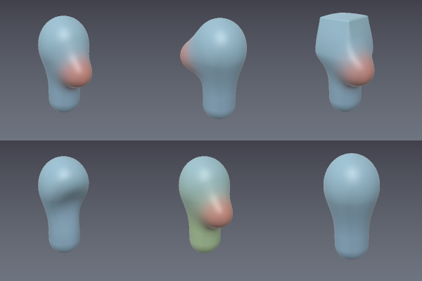

Strokes can be grown after they are placed, which is what a drag gesture
issues.

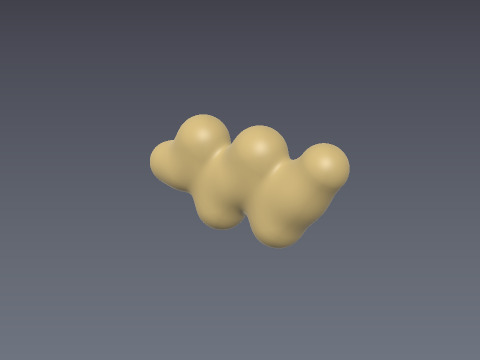

Node ids come back from `Layer.add` and survive every edit, which is what lets
a UI hold a selection. Each entry point applies one command from the engine's
vocabulary — the same one `.clayspace` records.

### 11 — masks

A mask is a scalar field in [0, 1] scaling how strongly a brush may act: the
effective strength at a cell is `strength * (1 - mask)`. All three tiles below
run the same erase, with the same dither seed; the third has the left half
masked, and nothing there moves.


Painting the mask with a falloff gives a graded gate, so the cut fades out
across the boundary instead of stopping at a wall.

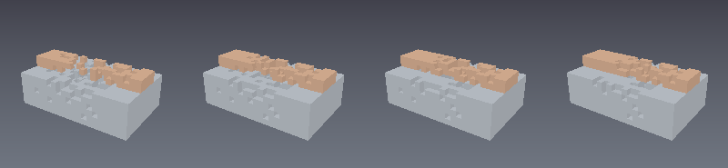

A mask is addressed in **world units on its own lattice**, not in a layer's
voxel cells, so it survives a resolution change and a `.clayspace` round trip —
the example asserts both. That is deliberate: masks silently dying on
voxelization is the most complained-about defect in the tool this engine is
measured against.

Masking gates edits where they are *authored*. Voxel edits consume it per cell
at edit time; it does not retroactively protect a region from SDF items already
in the edit list.

### 12 — strokes

A drag becomes stamps, and a stamp becomes an ordinary edit. Resolving is pure —
samples and a preset in, stamps out, no document touched — and applying produces
voxel brush stamps or nodes in a layer's edit list. Because a stroked edit is an
*ordinary* edit, undo, coalescing, `.clayspace` serialization and picking apply
to it without knowing this engine exists.

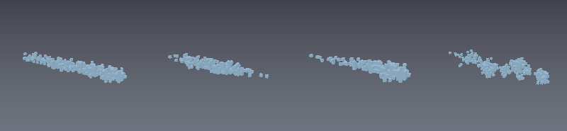

Steady stroke ("lazy mouse") lets the emission point trail the cursor. Seen from
above, the wobble drops from 0.050 to 0.011 across these three.

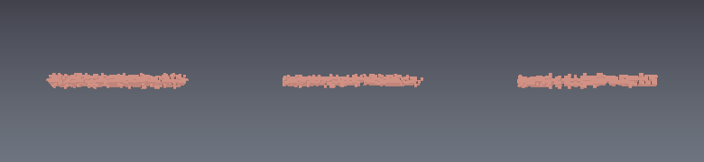

One stroke on an SDF layer: 67 nodes, and exactly one undo step.


The example asserts three things rather than showing them: spacing follows the
path and not the sample rate, jitter is a hash so a preset reproduces its stroke
exactly, and a preset from a newer schema version is refused rather than
reinterpreted. It also shows what freeze means for a declarative edit — a stamp
in a masked region produces no item at all.

### 13 — curves

A stroke point carries a type saying how it joins the next: a hard corner, a
Catmull-Rom spline through the points, an approximating B-spline that rounds
corners off, or a Bezier shaped by two local-space handles. All four tiles
below are the *same six control points*.

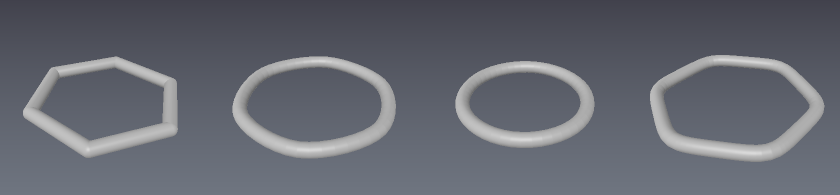

Typed points are tessellated into the segment chain the engine already
evaluates, at compile time, so a curve costs nothing at evaluation time and no
backend knows it exists. The tolerance is the largest distance a span's
midpoint may sit from its chord, and it is a property of the **document**, not
of the viewer — two builds have to agree on what a document means.

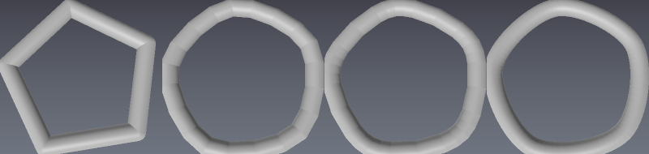

Bounds come from the tessellated curve rather than the control points. Both
control points of this arc sit at y = 0; the handles carry the span to y = 1.5,
and a bound taken from the control points would have culling drop the arc and
picking miss it.

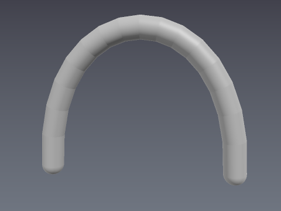

The example asserts three things rather than showing them: an all-hard chain
evaluates bit-identically to what it did before types existed, a ray really
finds the arc outside the control hull, and editing a placed curve undoes
exactly.

### 14 — the cut tool

A shape drawn over the model, cut through it: rect, circle, polygon, or a
spline lasso flattened through the curve tessellator.


Which side survives is the **op**, not a parameter of the cut — subtract
removes what the shape covers, intersect keeps only that. 3DCoat's "Shift =
keep-outer" modifier is exactly this choice.

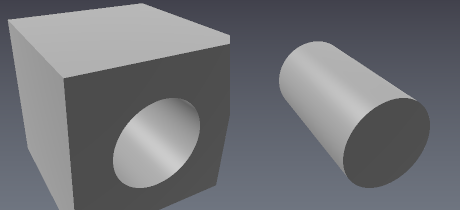

The sweep is sized to the region so a cut goes all the way through; giving the
extent by hand is how a deliberate partial cut is expressed, and rounding
bevels the walls.

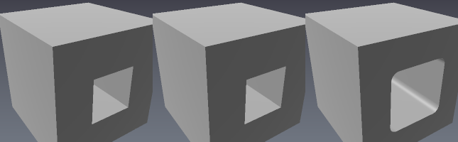

Nothing in the cut knows where "the camera" is — only what frame it was handed,
so the same call from a frame looking down cuts top to bottom.

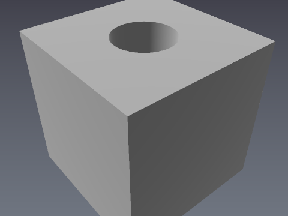

The example asserts the design's load-bearing claim: **a cut is a prism, not a
frustum**. The same cut resolved from a frame ten times further away gives the
identical solid. A converging cut would have a face that is not flat and a
result that depended on where the camera stood.

### 15 — voxel verbs and repair

The four sculpting verbs the study catalogues that were missing, plus the
pre-bake repair pair.

**fill-cavities is not a morphological closing.** Closing was the first attempt
and the code found two reasons it is wrong: a ball of radius r *fits into* a
dent wider than r, so a larger structuring element fills **less**; and a
closing cannot seal a one-cell perforation in a one-cell wall at all, because
the erosion reaches through from the void behind it. The rule that works is
that an empty cell with at least four of its six face neighbours occupied is
inside a pocket. The right-hand pair below is a shallow dent, deliberately left
alone — that is the line, and smoothing is the verb for the other side of it.

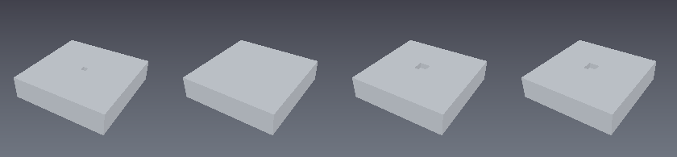

Scrape flattens and smooths from **one** snapshot. Calling the two verbs in
sequence would let the flatten's output feed the smooth's neighbourhood, which
is what the snapshot discipline exists to prevent.

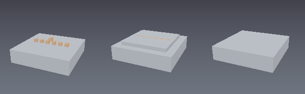

Smudge drags the *skin* and leaves the interior; grab translates every cell in
its region. Same displacement, different verbs.

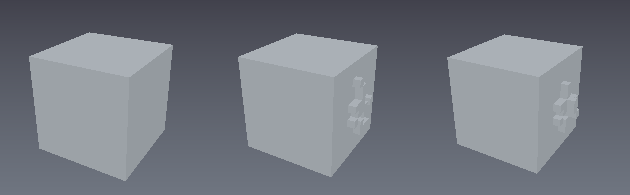

Carve takes a caller-supplied `(H, W)` alpha, projected along a direction. The
engine decodes no images — a host that has an alpha has already loaded the PNG.


Repair reports before it repairs, because a destructive operation whose input
is somebody's sculpt should be askable before it is answerable. The renders are
**cut away**, since the whole point is interior geometry: a pierced shell (the
outside reaches in, so nothing is enclosed), the same shell with its hole
sealed (one enclosed void now), and the void filled.


Enclosure is decided by a flood over *empty* cells from outside the bounds, not
guessed at from a local neighbourhood — so a box with a wide mouth is left
alone, which the example asserts.

### 16 — loft

`lift.h` has had a loft since the beginning and no document could use one. The
spec said why in a sentence: *"Loft remains header-only until an item can carry
two profiles."*

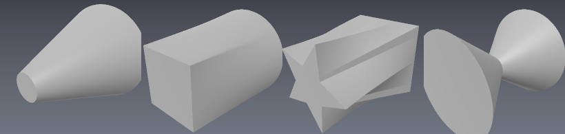

Three or more profiles are **bracketed, not averaged** — wide-narrow-wide gives
a waist, because the middle profile is actually reached. That is why this took
N from the start: nothing about the opcode wanted to be limited to two.

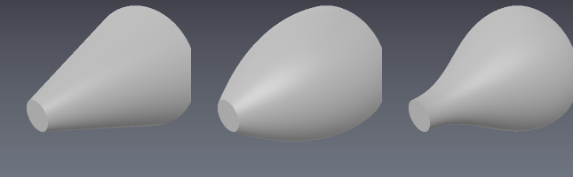

**A loft is a bound, and its Lipschitz is not one.** Interpolating two distance
fields does not give a distance field, and the interpolation adds a term
proportional to how far apart the profiles are over how short a depth they are
mixed across. The example prints the safe step scale falling as the depth
shrinks — 0.53, 0.36, 0.22, 0.10 against 1.00 for an exact primitive — and
fails if that ordering ever stops holding. That number is the raymarcher being
told to be careful; reporting 1 would have it step through the surface.

Once placed, nothing about a loft is special: it subtracts, blends and deforms
like any other item.

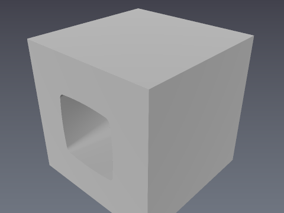

### 17 — swept along a guide

The same profiles as a loft, carried along a **guide curve**. The guide is an
ordinary control-point curve — a guide is not a new kind of curve.

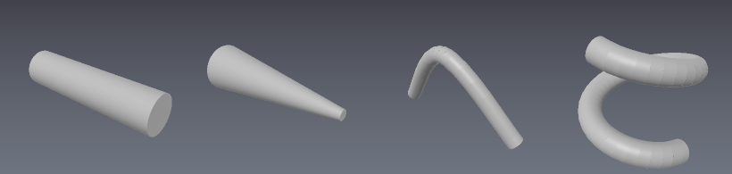

**The frame is parallel-transported, not derived.** A Frenet frame flips at an
inflection and is undefined where the curve is straight, so a sweep built on
one would twist exactly where it should be calmest. Transport is sequential
along the curve, so the compiler walks the guide once and stores a frame per
vertex. Below: bend, straighten, bend back, with a flat profile whose
orientation would be obvious if it flipped — the example asserts it does not.

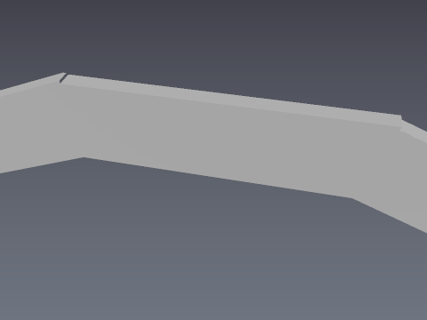

Profiles are distributed by **arc length**, so a guide whose points bunch does
not bunch the profiles. The ends are the profile itself — a flat cap, since a
profile need not be a circle.

A sweep compresses space on the inside of a bend by `R / (R - r)`, so the safe
step scale falls as the guide tightens. A profile wider than the guide's
tightest bend folds the sweep through itself: **not refused**, because a guide
is editable after the fact, but the step scale collapses to 0.0001 so the
raymarcher crawls rather than stepping through a surface it was told was a
distance field. The example prints both, and fails if either stops holding.

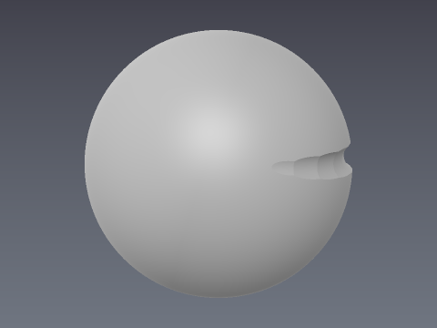

### 34 — an organic character

A heroic figure taken from blockout to finish, one render per stage: masses,
limbs, muscle, wardrobe, detail. The organic disciplines in one place —
authored symmetry (`layer.mirror("x")` plus `mirror=True`, so the left arm IS
the right arm), smooth blending sized to *disappear*, `taper` doing what a
constant-radius capsule cannot, and RELIEF/INCISE using an item as a **region**
rather than a shape, which is why a pec swells the chest instead of sitting on
it as a lump.

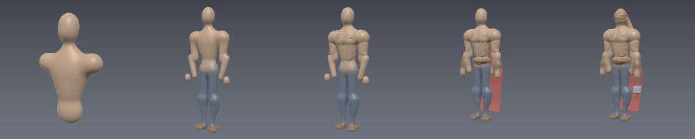

The cape is a swept profile — profiles distribute by arc length, so the flare
is smooth rather than stepped at the guide vertices — and the hair is a stroke
preset with taper, the same call a host makes when a stylus drags.

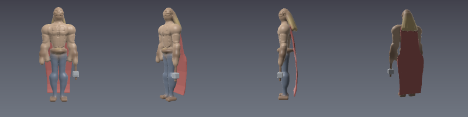

### 35 — a hard-surface helmet

The opposite discipline. On an organic sculpt the blend radius is chosen to be
invisible; here **the seam is the design**, so the combine mode does the work a
brush does next door. `Chamfer` bevels a seam where `Smooth` would fillet it,
and the extended modes are seam treatments rather than volume operations:
GROOVE cuts a panel gap, TONGUE raises a lip, INSET steps a plate down inside
its border, PIPE leaves the bead a cable gland has.

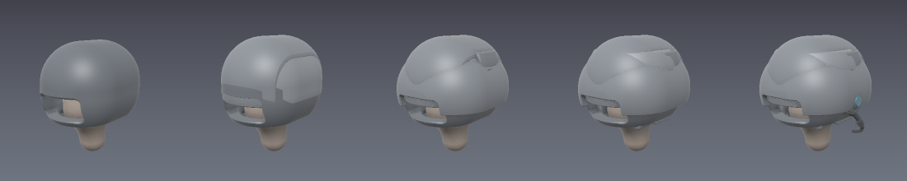

Every repeated feature is authored once — the vent slots and the bolt ring are
single items with `repeat_grid` / `repeat_radial`, so the tape carries one
instruction rather than forty. The last panel is the voxel half of hard
surface, where there are no seams to shape and the verbs are subtractive
instead: `sculpt_flatten`, `sculpt_scrape`, and `sculpt_fill_cavities` closing
the pinholes a dithered stamp leaves.

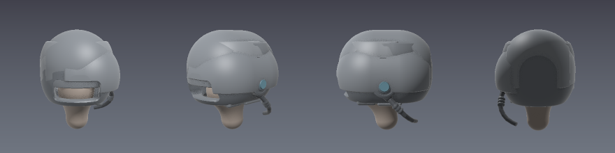

### 36 — groups

35 gives every armour plate a **layer** of its own, because a plate is a shell
INTERSECTED with a cutter and an op applies to everything accumulated before
it: on one shared field that intersect would trim the helmet too. A **group**
is the thing that was actually wanted. Its children compile as one
sub-expression, so the intersect stays inside it and the group's own op joins
the result to whatever the layer already holds — four groups on one layer here,
where the layer-per-plate technique needs four layers.

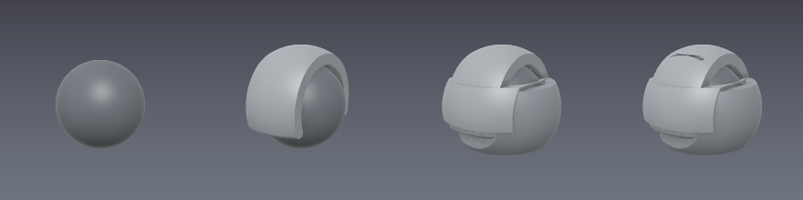

The right-hand half is the same edits with no group at all, kept on the page
because it is what "the op applies to everything" looks like: the cutter slices
the core as well, and what is left is the cutter's own box.

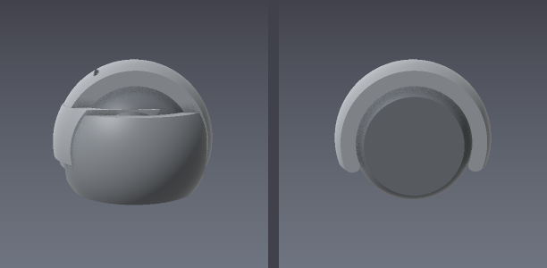

`Op.INLINE` is the other direction — a group whose children apply to the outer
chain exactly as if they had been added there, so it names and moves a run of
edits without changing the field. The script asserts that, bit for bit.

## Notes

- **This page documents 00-17 and the three showcase examples.** The gallery
### 36 — a mesh a document carries

`19` imports a model so it can be *sculpted*: the triangles become a distance
field and stop being triangles. This is the other reason to import one — a
scan, a scale reference, a kit part — where the requirement is the opposite,
and the model has to leave the pipeline as what it entered as. A **mesh layer**
stores the triangles verbatim, saves them inside the `.clayspace`, and is never
evaluated.

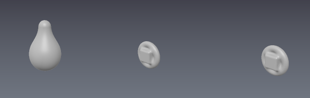

Left is what the document's own field contains, which is the sculpt and nothing
else: the geometry lives beside the document, where the module layering keeps
`clay::scene` from ever seeing it, so "a mesh layer does not change what the
document evaluates to" is structural rather than a promise. The middle and
right panels resample the carried triangles purely to draw them — the very
approximation a mesh layer exists to avoid — and show that moving the layer
moves what gets exported, not what is stored.

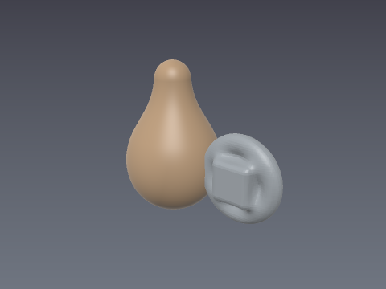

### 44 — exporting quads, and what "quads" means here

**This is a regular quad grid derived from a sampling lattice. It is not
field-aligned retopology.** The quads follow the lattice, not the form: no edge
loops around a limb or a mouth, no poles at features, no denser rows where
curvature asks for them, and nothing animation-ready. It is the input a
retopology pass *replaces*, not the output one produces. The wireframes are the
honest statement of that — the grid runs straight across the flat and wraps the
bulge without ever noticing where the two meet.

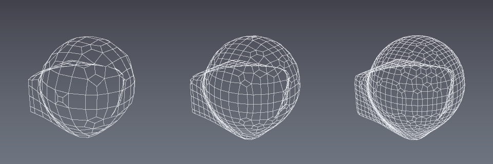

The same form at ~400, ~1000 and ~2000 quads. **A count is a target the mesher
approaches, never one it hits**: the only lever is the lattice cell size, so
asking for a number is a short search over it and the script prints requested
against actual for every mesh. Count goes as `cell⁻²`, so landing inside 5-10%
is the expectation and the report says whether it converged, what cell size it
settled on, and how many meshes that cost.

`OBJ`, `PLY` and `FBX` carry the quads as four-corner faces. **`GLB` does
not** — glTF 2.0 defines no quad primitive mode, so the writer emits the same
surface as triangles. The script prints that rather than leaving it to be
discovered in Blender.

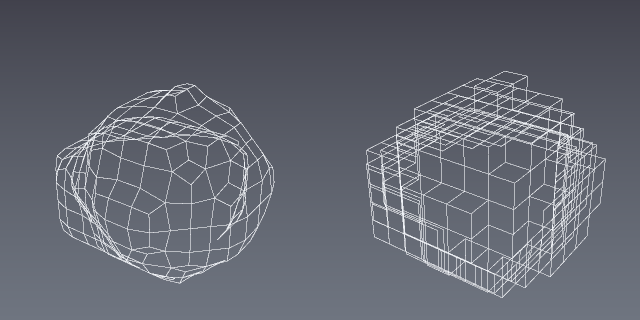

A voxel sculpt is two different subjects. Left is the **dual**: the rounded
form, the same lattice the smooth mesher builds. Right is **faces**: one planar
quad per exposed voxel face, which is the boxes the model actually is. At the
grid's own voxel size with no blur the two carry the *same number of quads* — a
sign-changing lattice edge is exactly an exposed face, and the four cells
around such an edge always own a vertex — and completely different surfaces.
The script asserts that identity rather than checking for it; a coarser dual
cell or a blur pass resamples the occupancy and breaks it, which is why it is
stated with its conditions.

## 45-47 — fixed-topology mesh brushes

Every other brush in this gallery edits a field. These edit the **vertices of a
mesh a document is carrying**, and hold one line while they do: topology never
changes. The index buffer that goes in comes out byte for byte, which is the
whole reason they exist — a retopologized quad mesh re-enters a document as a
mesh layer, and the only other way to edit one is `Volume.from_mesh`, which
resamples it and throws the edge loops and uvs away.

- **`45_mesh_brushes`** — the six primitives (grab, draw, inflate, smooth,
  pinch, flatten) on an imported OBJ, driven from a real pick. Draw and inflate
  side by side, because they look like one brush and are not: draw takes ONE
  direction for the stamp and inflate takes each vertex's own, and the script
  measures the difference rather than asserting it. Ends on a quad export
  sculpted with a stroke and the quad list compared element for element.
- **`46_mesh_brush_compositions`** — clay, crease, scrape, polish and
  snakehook. Each is one stamp against one snapshot rather than a sequence of
  calls, for the reason `sculpt_scrape` already gives. Clay's flat top is
  measured against a plane fit; polish's gate is swept over three angles, which
  is the honest way to show a tradeoff; snakehook's triangles stretch 6x and
  the script says so, because that stretch is the artist's signal the mesh
  wants retopo and not a defect.
- **`47_mesh_brush_reach_and_undo`** — the three things that make the above
  usable on a real asset. A brush on the inside of one prong of a fork must not
  dent the other, which is the Move Topological rule and is visible in the
  render. A mask freezes half a stroke, for a displacement verb and for smooth.
  And a whole gesture undoes from its vertex deltas, bit for bit.

## 48 — an imported model straight to voxels

`19_mesh_import` takes triangles into a *field* in one step. Reaching the voxel
verbs took four, and paid for **two** samplings: triangles into a narrow band,
then the band into cells — so the second quantised a field that was already
quantised, and the document in the middle existed only to be thrown away.

`rasterize_mesh` asks the triangles directly. The script measures that rather
than describing it: the two paths agree to 99.8% of the cells on a thick model,
the direct one keeps 12% more of a fin thinner than two cells, and **only the
direct one carries the model's colour** — `Volume.from_mesh` samples a distance
field, which has no colour in it, so the detour reaches the palette with nothing
to quantise. It also rasterizes a model with its cap deleted on purpose: the
generalized winding number degrades across the opening instead of flipping a
half-space, which is what a parity ray cast would do and is why the sign is
what it is. It ends by sculpting the import with the voxel verbs, since
reaching them without a document is the point of the trip.

## Notes

- **This page documents 00-17 and the two showcase examples.** The gallery
  text has drifted behind the scripts; 18-33 and 36 run in CI and regenerate
  their output, they just have no section here yet.
- **This page documents 00-17, the two showcase examples and 36.** The gallery
  text has drifted behind the scripts; 18-33 run in CI and regenerate their
  output, they just have no section here yet.
- **Committed models are budgeted.** `_render.save_model` fails above 400 KiB
  so the repository does not accumulate large binaries; `export_model` is the
  one place meshing settings are tuned. Binary PLY is much smaller than ASCII
  OBJ for the same mesh.
- **Voxel meshes report `watertight=False`.** Greedy meshing gives each merged
  quad its own vertices, which is what keeps per-face colour exact. The
  duplicated vertices make an index-based watertightness check see boundary
  edges even though the surface is geometrically closed. SDF meshes, which
  share vertices, report watertight.
